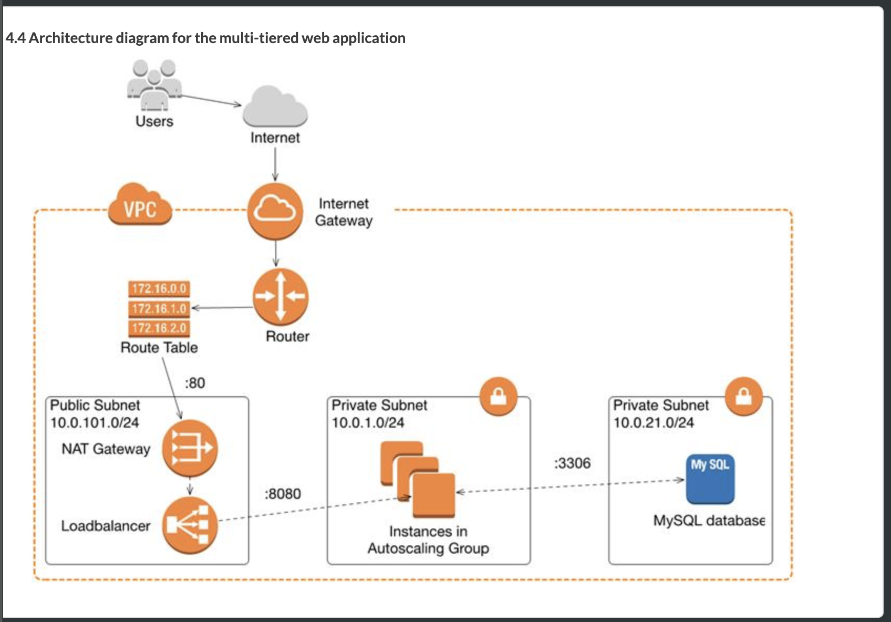

# DevOps Instruction - Web application

For detailed explanation on how things work with kotlin spring boot build instruction on pipeline. I've used `bash` script in the main focus.

## Infrastructure as a Code on AWS Cloud Platform.

1.  Create a Github repository for the code they have written (including actions based build workflow)

`git clone https://github.com/beaubaby/devops_web_api.git`

2.  Install terraform and author the following on any cloud provider

 * Additional non-default VPC with internet gateway and route table 
 * Private and Public Subnets
 * SSH Key Setup
 * Virtual Compute instances that run a web service
 * Virtual Compute instances that run a database for leveraging an external source such as RDS
 * Render a simple website that shows information being either pulled out of the data layer or from some 3rd party API
 * Logging enabled to a central place

Alternatively,
 - All of the above, but running on EKS, GKE, or AKS.
 
#### High-Level Infrastructure diagram #### 

- Multi-tiers Module (Multi AZ)



- Best practice conceptual (If it can be done)


 
#### Deployment Instruction ####

To test connection with own database

1.Containerize source code. Run test before containerize.


    ./go lint
    ./go test
    ./go dependency_check
    ./go static_check
    ./go build

or can be run (install gradle locally)

```
gradle lint
gradle test
gradle ktlintCheck
gradle build
```

Containerize docker in production and then push to ecr (Currently,still cannot implement it on time)

    ./go infrastructure_apply_ecr
    ./go containerize
    ./go push_container


2.Initial own database
   - Start DB local for dev application on local

    ./go startDb


3.Check your microservice to connect the database on local with set configuration profile

`-Dspring.profiles.active=local`

4.After test passed, can stop your database. Run

    ./go stopDb

5.Deploy application to each environment

```
./go infrastructure_apply_app
```

### Tech debt. 

- Need to create iam role to awsume to deploy out application to gain more secure and protect others attrack to our platform
- Need to have cloudfront (CDN) to connect to S3 and restrict S3 to private Cloud
- Need to create S3 to keep frontend data
- Need to initial database with script before run pipeline to deploy infrastrcture each environment
- Need to have API GATEWAY makes it easy to deploy scalable and secure APIs.
- As posible, we should do frontend with serverless API using fargate and backend replace with EKS
- Have to change database to aurora to easy to manage and can automatically redundant to master node and read node. Also Multi AZ
- Should create Cloudwatch to collect centralize logs